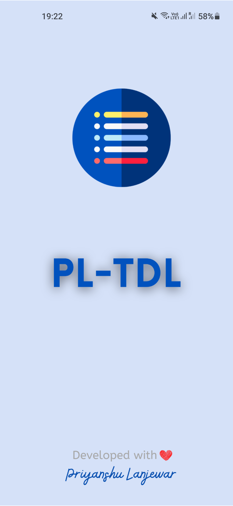
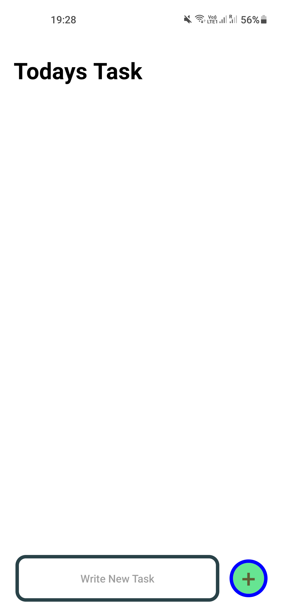
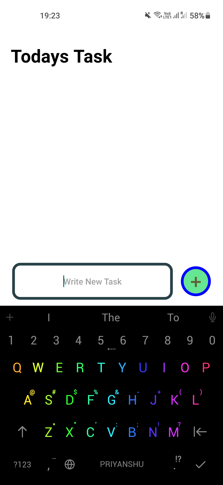
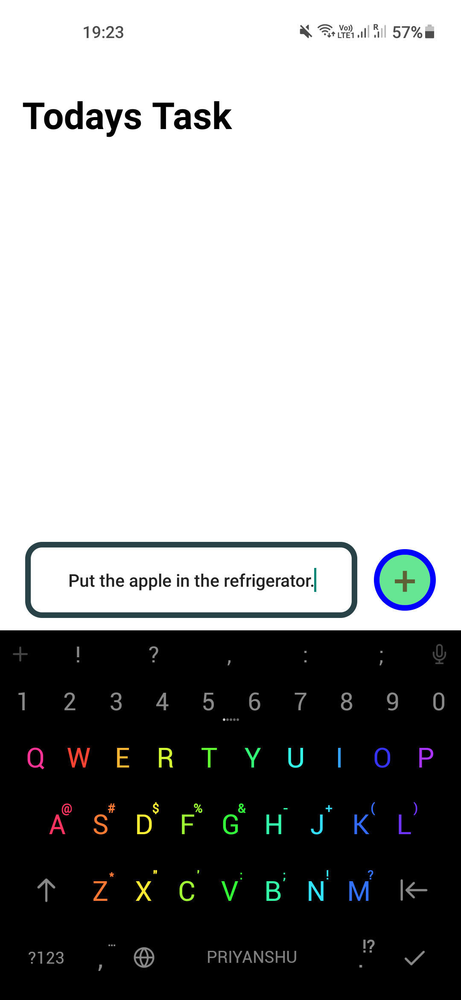
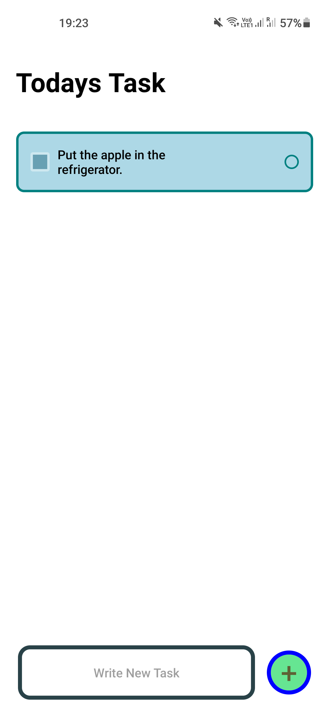
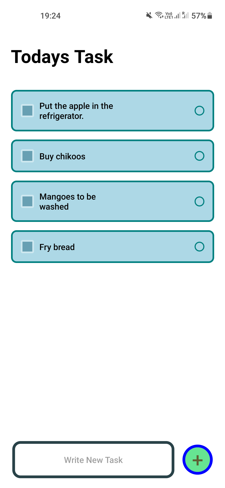

# PL-TDL
A simple TODO list app where you can add Tasks and Tap them to Delete once they are done.

## About Development
  

## Features 
- Add Task By Simple tap.
- Delete Tasks by a simple task.
- No Fear off Data after closing app, it will be stored.

##  Installation
- To Download the app click  [here](https://github.com/priyanshu-lanjewar/PL-TDL/releases/download/1/pl-tdl.apk)
- Click on **pl-tdl.apk** and install.
- Done. !! 

## How to use ?
- Click on the text box to enter task and then click on  button to save it to list.
- To delete items tap on required the desired task.
- Done. !!
## Screenshots

 &nbsp;&nbsp;  &nbsp;&nbsp;  &nbsp;&nbsp; 
 &nbsp;&nbsp;  &nbsp;&nbsp;  
